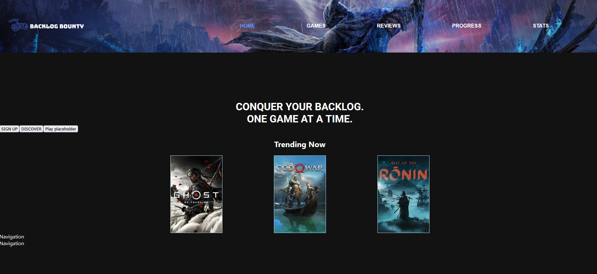
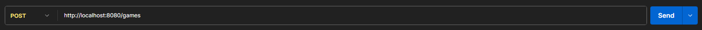
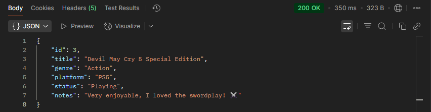
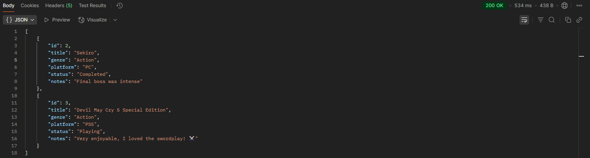
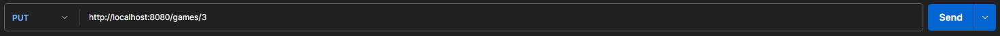
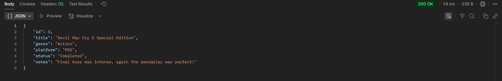
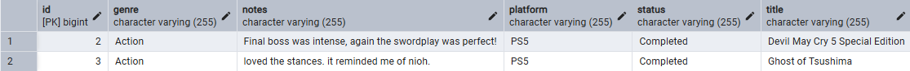

# Progress Snapshot 04/09/2025



# Backlog Bounty 🎮
**Backlog Bounty** is a full stack web app for managing your video game library, tracking progress, logging reviews for other users, and setting gaming goals.

Backlog Bounty was designed to simulate real-world engineering practices and showcase full-stack development skills using Java (Spring Boot), PostgreSQL, and React (WIP).

## Features:
- ✅ Add, view, update, and delete games (CRUD functionality)
- ✅ Add reviews and notes to games
- ✅ Track game status (e.g., Completed, Playing, Wishlist)
- ✅ Built-in RESTful API using Spring Boot
- ✅ PostgreSQL integration allowing for data persistence.
- ❗Frontend WIP using React
- ❗Connection to PowerBI dashboards using PostgreSQL database.

## 💼 Why it matters

This project is built to solve a familiar problem for gamers: keeping track of a growing backlog. Backlog Bounty helps users organize and document their game progress in one place.


- RESTful API architecture with clear endpoints
- Structured backend using Spring Boot with layered services
- PostgreSQL database integration and schema design
- Manual API testing via the use of Postman
- Foundation for a responsive frontend and user authentication

## Tech Stack
- Java + Spring Boot (current)
- H2 (scrapped in favour of PostgreSQL)
- Postman (API testing)
- PostgreSQL (in use)
- React (in use)
- .Net 8 Web API (planned)
- Azure App Service & PostgreSQL (50%)

## 🔄 Roadmap
- [x] Basic CRUD with Java & Spring Boot
- [x] Add reviews and progress logs
- [x] Migrate to PostgreSQL
- [x] Get started on React frontend
- [ ] Complete frontend
- [ ] Deploy full stack to Azure
- [ ] Employ PowerBI dashboards with data from PostgreSQL


## 📸 Backend Functionality
The backend of this project is fully functional as intended. It will include more functions in the future. Below are visual demonstrations of a few key features tested using Postman.


### 🟢 POST /games
Create a new game entry by sending JSON data via Postman.



### 🟡 GET /games
Retrieve all saved games from the database.



### 🔄 PUT /games/{id}
Update an existing game's details using its ID.




### 🗃️ PostgreSQL Table View (pgAdmin)
Game data is persisted in PostgreSQL. Below is a snapshot of the database table after insertion.


## 🚀 Quick Start (Backend, Frontend WIP)

```bash
# 1. Clone the repo
git clone https://github.com/yourusername/backlog-bounty.git
cd backlog-bounty

# 2. Navigate to PostgreSQL and download appropriate files
https://www.postgresql.org/download/

# 3. Use pgAdmin to create a database named 'backlogbounty'

# 4. Update your application.properties:
spring.datasource.url=jdbc:postgresql://localhost:5432/backlogbounty
spring.datasource.username=your_db_user
spring.datasource.password=your_db_password

# 5. Run the Spring Boot application
./mvnw spring-boot:run
